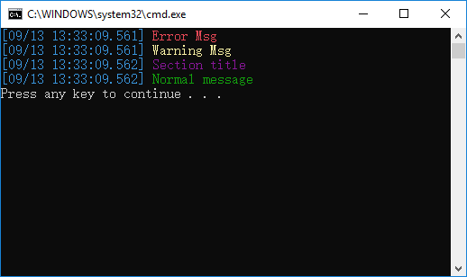

# logger
A “colorful" console logger. 

Example usage:

```
#include "GlobalLogger.hpp"

int main(int argc, char** argv)
{
    logErr << "Error Msg\n";
    logWrn << "Warning Msg\n";
    logSec << "Section title\n";
    logMsg << "Normal message\n";
}
```

Console output:


